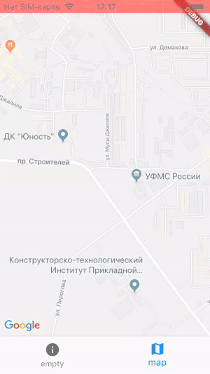

# flutter_map_bottom_tabs_test

This application shows bug with BottomNavigationBar on physical iOS devices when content of one tab is Google map from [this plugin](https://pub.dartlang.org/packages/google_maps_flutter)

## How to run

Put your Google sdk key to `AppDelegate.m` and `AndroidManifest.xml` before run.
